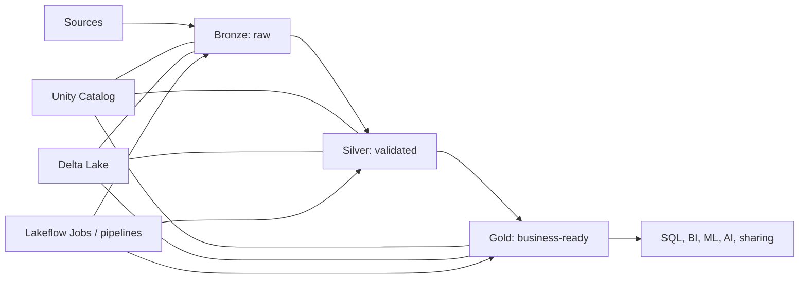

# Start Here

This vault is designed in two layers:

1. **Fast competence:** learn the few concepts and actions used in most daily Databricks work.
2. **Selective depth:** open a deep dive only when your role or project needs it.

## Choose your route

| You are… | Start with… | Then open… |
|---|---|---|
| Completely new | [[00 - The 80-20 Learning Path]] | [[08 - Capstone - From Files to Gold]] |
| A data engineer | [[05 - Medallion ETL]] | [[Streaming and Auto Loader]], [[Lakeflow Pipelines]] |
| An analyst | [[03 - Spark, DataFrames, and SQL]] | [[Databricks SQL and AI-BI]] |
| A platform or security engineer | [[06 - Unity Catalog Essentials]] | [[Unity Catalog Governance]], [[Security and Production Guardrails]] |
| An ML or AI practitioner | [[01 - The Databricks Mental Model]] | [[MLflow and AI Workloads]] |
| Preparing for an interview | [[Databricks Glossary]] | [[Knowledge Check]] |

## The mental picture



Spark performs distributed computation. Delta Lake makes lake data behave like reliable tables. Unity Catalog governs data and AI assets. Compute runs work. Lakeflow automates it. SQL, BI, ML, and AI consume the results.

## How to use each note

- Read **Why it matters** first.
- Run the smallest example.
- Use **Decision rules** to choose a production approach.
- Finish the **Checkpoint** without looking back.
- Follow only the deep links relevant to your work.

## Safe practice setup

Use a disposable schema and replace the example names if needed:

```sql
CREATE SCHEMA IF NOT EXISTS main.training;
USE CATALOG main;
USE SCHEMA training;
```

Do not run `DROP`, `VACUUM`, broad grants, or cost-intensive workloads against shared or production objects. Check your cloud, region, runtime, and permissions because availability differs.

## Continue

Start the clock: [[00 - The 80-20 Learning Path]].
