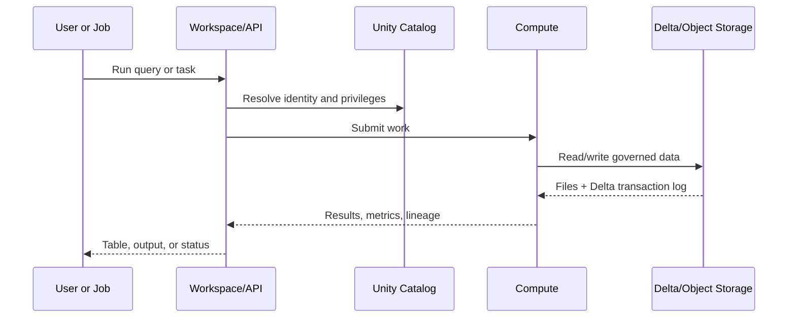

# The Databricks Mental Model

## Why it matters

Most beginner confusion comes from mixing four different layers: the user interface, compute, data storage, and governance.

## One sentence per layer

- **Databricks workspace:** collaborative UI and API surface for notebooks, queries, jobs, pipelines, dashboards, and assets.
- **Compute:** resources that execute SQL, Python, Spark, ML, or AI workloads.
- **Apache Spark:** distributed processing engine used for large-scale data computation.
- **Delta Lake:** table storage layer that adds a transaction log and reliability on object storage.
- **Unity Catalog:** governance layer for data and AI assets, permissions, lineage, discovery, and auditing.
- **Lakeflow:** ingestion, declarative pipelines, and job orchestration capabilities.
- **Databricks SQL:** warehouse-oriented SQL, dashboards, alerts, and semantic/BI experiences.
- **MLflow:** lifecycle, evaluation, observability, and registry tools for ML and AI work.

## The request path

## Lakehouse, without marketing language

A lakehouse keeps data in low-cost object storage while adding table reliability, governance, SQL performance, and support for data engineering, analytics, ML, and AI. It aims to avoid duplicating the same data into disconnected systems for each workload.

## Four objects to recognize immediately

| Object | Think of it as | Common mistake |
|---|---|---|
| Notebook | Interactive document with executable cells | Treating it as the production orchestrator |
| SQL warehouse | Compute optimized for SQL workloads | Calling it a storage system |
| Delta table | Governed table backed by files and a log | Editing its files directly |
| Job | Versionable workflow of tasks and triggers | Building business logic in task wiring |

## Checkpoint

Explain why data can persist after compute stops. Answer: compute and storage have separate lifecycles; tables live in cloud storage and are governed independently.

Next: [[02 - Workspace, Notebooks, and Compute]].
