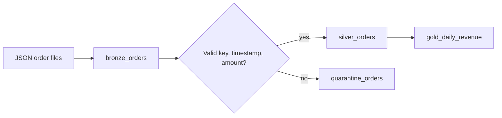

# Medallion ETL

## The rule

Each layer has a contract. Quality and business meaning increase as data moves forward.

| Layer | Purpose | Typical work | Avoid |
|---|---|---|---|
| Bronze | Preserve source truth and ingestion metadata | Append, parse envelope, record source/file/time | Business aggregation, destructive cleanup |
| Silver | Produce validated reusable entities/events | Types, deduplication, quality rules, conforming keys, CDC | Dashboard-specific metrics |
| Gold | Serve a defined business use case | Facts, dimensions, aggregates, metric-ready tables | Repeating raw cleanup logic |

Bronze is not “bad data,” and Gold is not automatically one giant table.

## Example flow



## Minimum ingestion metadata

Keep enough context to audit and replay:

- source system or topic
- source file/path or event identifier
- ingestion timestamp
- batch/run identifier when useful
- rescued/unparsed payload for schema drift

## Idempotency patterns

- File ingestion tracks files or checkpoints; do not infer completion from row counts alone.
- Batch overwrite replaces a precisely bounded partition or predicate, not the entire table accidentally.
- `MERGE` uses a stable key and a deduplicated source.
- Streaming writes use a durable, unique checkpoint per query.
- Gold is rebuildable from trusted lower layers.

## Data quality

Express rules close to the dataset they protect:

```sql
SELECT *
FROM main.training.bronze_orders
WHERE order_id IS NOT NULL
  AND order_ts IS NOT NULL
  AND amount >= 0;
```

Do not silently discard failures. Count, quarantine, or deliberately stop based on business impact.

## Decision rule

Use medallion layers when they create meaningful contracts and reuse. Do not create three physical copies for every tiny dataset merely to satisfy a diagram.

## Checkpoint

Where should duplicate source events be resolved? Usually Silver, while Bronze preserves what arrived and Gold consumes the trusted entity/event contract.

Next: [[06 - Unity Catalog Essentials]]. For ingestion depth: [[Streaming and Auto Loader]].
