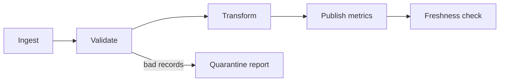

# Jobs, Pipelines, and Operations

## Choose the right automation layer

| Need | Use | Core idea |
|---|---|---|
| Coordinate notebooks, scripts, SQL, dbt, pipelines, and ML tasks | Lakeflow Jobs | Explicit task DAG, triggers, parameters, retries, notifications |
| Declare batch/streaming datasets and dependencies | Lakeflow pipelines | Dataflow graph, incremental processing, quality expectations |
| One-off exploration | Notebook/query | Human-driven iteration, not production scheduling |
| Project resources as code across environments | Declarative Automation Bundles | Versioned resource and source deployment |

Lakeflow pipelines were historically associated with “Delta Live Tables” or DLT. Declarative Automation Bundles were formerly “Databricks Asset Bundles.”

## A good Job task

A task should have:

- explicit inputs and outputs
- a stable compute choice
- parameters with defaults and validation
- retry behavior appropriate to side effects
- a timeout
- an owner and notification path
- observable row counts, quality, freshness, and cost signals

## Dependency design

Do not create task dependencies merely because tasks are listed in that order. Depend only on real data or control requirements so independent work can run in parallel.

## Failure semantics

- Retry transient network or infrastructure failures.
- Do not blindly retry deterministic bad data or invalid SQL.
- Make writes idempotent before enabling retries.
- Alert on final failure and on dangerous delay—not every harmless retry.
- Preserve run context: input version, parameters, code revision, and output metrics.

## Checkpoint

You need a daily workflow that ingests files, refreshes a pipeline, then runs a quality report. Use a Lakeflow Job to orchestrate tasks; let the pipeline manage dataset dependencies inside the transformation stage.

Next: [[08 - Capstone - From Files to Gold]]. For depth: [[Lakeflow Pipelines]] and [[Declarative Automation Bundles and CI-CD]].
