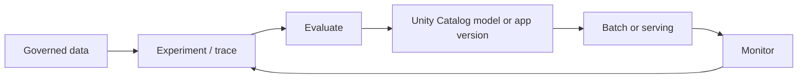

# MLflow and AI Workloads

MLflow on Databricks supports experiment tracking, evaluation, registry, deployment integration, and observability for ML models and AI/agent applications.

## Lifecycle



## Track what makes a result reproducible

- code revision and environment/dependencies
- input table versions or immutable snapshot identifiers
- parameters and feature definitions
- metrics with dataset/split context
- artifacts and model signature
- evaluator versions, prompts, and scorers for AI systems

```python
import mlflow

with mlflow.start_run():
    mlflow.log_params({"max_depth": 8, "seed": 42})
    mlflow.log_metric("validation_f1", 0.91)
    # Log the fitted model with its signature using the flavor for your library.
```

## Model governance

Use Unity Catalog registered models for centralized ownership, permissions, lineage, and cross-workspace discovery. Promote based on evaluated evidence and deployment policy, not a mutable notebook state.

## AI and agent evaluation

Traditional accuracy is insufficient for agents and LLM applications. Evaluate task success, groundedness, correctness, safety, latency, cost, and failure modes on a versioned representative dataset. Use tracing to inspect intermediate tool/model steps and detect regressions.

## Serving checklist

- input/output schema and error contract
- access control and secrets
- latency and throughput target
- cost/rate controls
- safe fallback and rollback
- request/response privacy and retention
- drift, quality, and operational monitoring

## Failure modes

- data leakage between train and validation
- untracked feature changes
- comparing metrics computed on different data
- deploying an artifact without its environment/signature
- prompt or evaluator changes without versioning
- monitoring infrastructure metrics but not output quality

## Official reference

- [MLflow on Databricks](https://docs.databricks.com/aws/en/mlflow)

Related: [[Unity Catalog Governance]], [[Monitoring and System Tables]].
